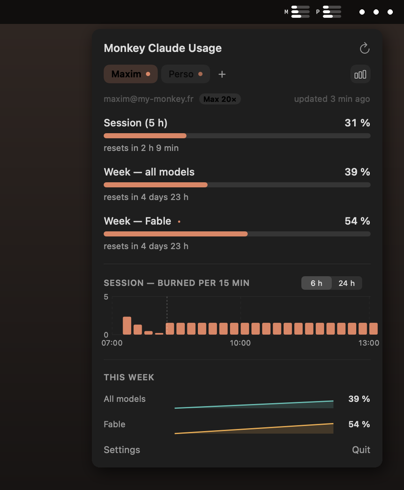
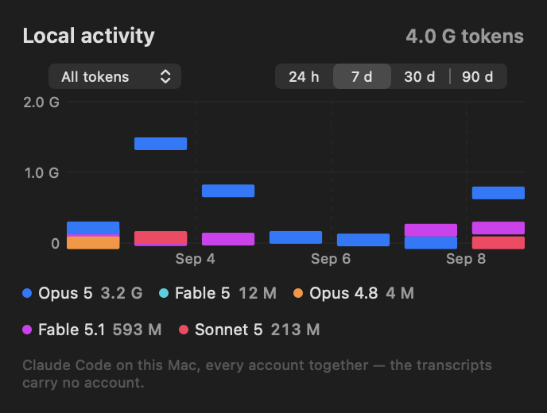

<div align="center">


# Monkey Claude Usage

**Every Claude account you own, metered in the macOS menu bar.**

[](https://github.com/my-monkeys/monkey-claude-usage/actions/workflows/ci.yml)
[](LICENSE)
[](#install)
[](Package.swift)



</div>

You start a task and Claude tells you the limit is spent. For how long — ten minutes, or until
Thursday? And if you keep a personal account and a work one, finding out means signing out of
one dashboard to look at the other.

This app keeps the answer in the menu bar: one strip per account, one bar per window — the
5-hour session, the weekly all-models budget, and the weekly per-model ones. When a window is
spent, the bars give way to the only figure still worth reading.

<table>
<tr>
<td align="center"><br><sub><b>One account</b><br>session, week, weekly Fable</sub></td>
<td align="center"><br><sub><b>Two accounts</b><br>a letter each, rows aligned</sub></td>
<td align="center"><br><sub><b>Out of quota</b><br>a countdown, not a full bar</sub></td>
</tr>
</table>

## Install

```bash
brew install --cask my-monkeys/tap/monkey-claude-usage
```

Or take the `.dmg` from [Releases](https://github.com/my-monkeys/monkey-claude-usage/releases)
and drag the app to `/Applications`. It is signed with a Developer ID certificate and notarized
by Apple, so it opens on the first double-click — no Gatekeeper detour.

**macOS 14 Sonoma or later.** Apple silicon and Intel. A few megabytes, no Electron.

## Sign in

1. Click the menu bar icon → **Sign in with Claude**
2. Approve the page that opens in your browser
3. Paste the code Claude gives you back into the app

That is the whole setup.

**Adding a second account:** click **+** in the tab bar and do it again — but sign out of Claude
in your browser first, or use a private window. Otherwise the authorization page cheerfully
hands you another token for the *same* account. The app spots the duplicate and refreshes the
existing tab, so nothing breaks; you have simply not added what you meant to.

## What you get

- **Several accounts at once** — personal and work, side by side, each with its own tokens in
  the macOS Keychain. This is the reason the app exists.
- **Every window your plan actually has**, including the per-model weekly ones that most meters
  miss entirely.
- **A countdown when a quota is spent** — `5h 1h42`, instead of a full bar that says nothing.
- **Notifications** at 80 %, 95 % and when a window is spent.
- **Updates itself**, signed and verified. English and French, following your system.

<div align="center">

</div>

And an **Activity** tab with months of real token history, model by model — read from Claude
Code's own transcripts on this Mac, so it has something to show the minute you install it.

## Privacy

No analytics, no crash reporting, nothing phoned home. Your tokens stay in the login Keychain
and your history stays in your Application Support folder. The app talks to Anthropic, and to
GitHub when it checks for an update. That is the entire list.

---

**[How it works →](docs/how-it-works.md)** — the API, the two histories, the charts, the menu
bar rules, building from source.

## Credits

A [My-Monkey](https://my-monkey.fr) project, derived from
[claude-usage-mini](https://github.com/jeremy-prt/claude-usage-mini) by Jeremy Perret, itself
derived from [claude-usage-bar](https://github.com/Blimp-Labs/claude-usage-bar) by Krystian.

Not affiliated with, endorsed by, or sponsored by Anthropic. "Claude" is a trademark of
Anthropic, PBC, used here only to say what the app measures.

[BSD-2-Clause](LICENSE), like its ancestors.
