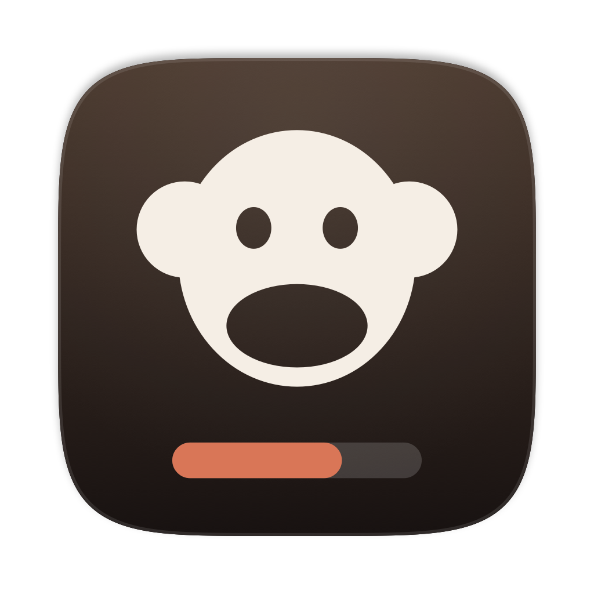
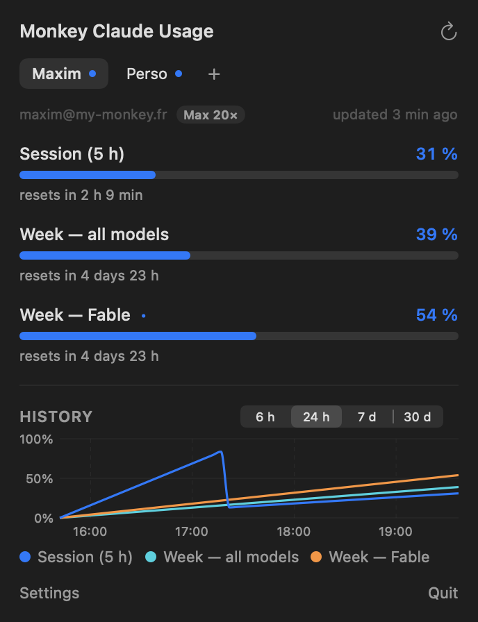

<div align="center">



# Monkey Claude Usage

**Your Claude limits — for every account you own — in the macOS menu bar.**

[](https://github.com/my-monkeys/monkey-claude-usage/actions/workflows/ci.yml)
[](LICENSE)
[](#install)
[](Package.swift)



</div>

---

Most usage meters watch one account and two windows. This one watches **as many accounts as
you have**, shows **every window the API reports** — including the per-model weekly limits
like **Fable** — and, when a limit is spent, stops drawing a full bar you cannot read and
**counts down to the reset instead**.

<table>
<tr>
<td align="center"><br><sub><b>One account</b> — session, week, and the weekly Fable window</sub></td>
<td align="center"><br><sub><b>Two accounts</b> — a letter each, rows still aligned</sub></td>
<td align="center"><br><sub><b>Out of quota</b> — bars give way to the countdown</sub></td>
</tr>
</table>

## Why

The `/api/oauth/usage` endpoint stopped describing limits as fixed fields (`five_hour`,
`seven_day_opus`, …) and now returns a generic `limits` array where each entry carries its
own scope. **Model-scoped weekly windows only exist in that array** — an app still reading
`seven_day_opus` sees `null` and shows nothing, even though you are at 54 % of your weekly
Fable budget. Monkey Claude Usage reads the array, falls back to the old fields when it is
absent, and renders whatever windows your plan happens to have.

And if you juggle a personal account and a work one, you were switching apps — or squinting
at the wrong number.

## Features

| | |
|---|---|
| **Several accounts** | Each account keeps its own OAuth tokens, in the macOS Keychain, independent of the Claude Code CLI. Sign in once per account; the menu bar shows them side by side. |
| **Every window** | Session (5 h), weekly across all models, and the per-model weekly windows — Fable, Opus, Sonnet — as the API reports them. No hard-coded list. |
| **Countdown, not a full bar** | A saturated limit is pinned at 100 % until it rolls over. The menu bar swaps its bars for `5h 1h42` — the only number that still means anything. |
| **History chart** | The endpoint has no history, so the app keeps its own: every poll is sampled and charted over 6 h / 24 h / 7 d / 30 d. |
| **Tabs in the popover** | One tab per account, a coloured dot per tab so you can see a saturated account without opening it. |
| **Notifications** | At 80 %, 95 % and when a window is spent. Once per crossing, per account, per window. |
| **English & French** | Follows the system language, or pick one. |
| **Light** | No Electron, no browser, no telemetry. A universal binary of a few megabytes. |

## Install

```bash
brew install --cask my-monkeys/tap/monkey-claude-usage
```

Or grab the `.dmg` from [Releases](https://github.com/my-monkeys/monkey-claude-usage/releases)
and drag the app to `/Applications`. The build is signed with a Developer ID certificate and
notarized by Apple, so it opens without the "unidentified developer" detour.

**macOS 14 Sonoma or later.** Apple silicon and Intel.

### Updates

The app updates itself, through [Sparkle](https://sparkle-project.org). It checks the
[appcast](appcast.xml) served from this repository, and every release is signed with an
EdDSA key the app carries the public half of — an update it cannot verify is refused.
Turn the check off in **Settings**, or run it by hand from **Check for Updates…** in the
menu bar's right-click menu.

Installing through Homebrew stays perfectly fine: the cask and the built-in updater install
the same disk image, so `brew upgrade` and the in-app update lead to the same place. Nothing
is reported anywhere — the app asks GitHub for one XML file and that is the whole of it.

Coming from **0.1.0**? That version shipped before Sparkle, so it cannot update itself. Run
`brew upgrade --cask monkey-claude-usage` once (or install the newer `.dmg`) and it takes
over from there.

## Adding accounts

1. Click the menu bar icon → **Sign in with Claude**.
2. Your browser opens the Claude authorization page. Approve it.
3. Claude shows a code. Paste it back into the app.

To add a **second** account, click **+** in the tab bar and repeat — but **sign out of Claude
in your browser first, or use a private window**. Otherwise the authorization page will
happily hand you a second token for the *same* account. (The app notices and refreshes the
existing tab instead of creating a duplicate, so nothing breaks — you just have not added
what you wanted.)

Tokens live in the login Keychain, one item per account, under
`fr.mymonkey.monkeyclaudeusage.credentials`. Removing an account deletes its Keychain item
and its history file; the Claude account itself is untouched.

## How it reads your usage

- **Authentication** — OAuth 2.1 with PKCE against `claude.ai`, using the public Claude Code
  client id. The same flow the CLI uses, run once per account. Tokens are refreshed
  automatically; nothing is ever sent anywhere but Anthropic.
- **Usage** — `GET https://api.anthropic.com/api/oauth/usage`, the endpoint behind the
  official dashboard. Polled every 15 minutes by default (5 to 60, your call), backing off
  when the API asks it to.
- **History** — the endpoint returns a point in time, not a curve. Each successful poll is
  appended to `~/Library/Application Support/fr.mymonkey.monkeyclaudeusage/history/<account>.json`
  and pruned to your retention window. The chart therefore **starts empty and fills in as the
  app runs** — it cannot show you yesterday if it was not running yesterday.

Nothing else is read. In particular the app never opens your Claude Code transcripts.

## Reading the menu bar

With **one account**, rows are labelled: `5h` session, `7d` weekly, then one row per
model-scoped window (`Fa` for Fable, `Op` for Opus…).

With **several accounts**, the row labels give way to a per-account letter and the row order
stays the same for everyone — session first, weekly next, model-scoped last. Rename accounts
in **Settings → Accounts** to control which letter you get.

When any window of an account is spent, that account's bars are replaced by the short code
and the time left on the **soonest** of its spent windows: `Fa 2d` means Fable is out for two
days, and the rest of the detail is one click away in the popover.

## Build from source

Requires macOS 14+ and Swift 6.

```bash
git clone https://github.com/my-monkeys/monkey-claude-usage.git
cd monkey-claude-usage
swift test                 # 12 tests over the payload parsing, countdowns, history and appcast
./scripts/build-dmg.sh     # → dist/Monkey Claude Usage.app and dist/MonkeyClaudeUsage-<v>.dmg
```

Releasing (signing, notarization, GitHub release, Homebrew cask) is one command and is
documented in [`docs/RELEASING.md`](docs/RELEASING.md).

## Architecture

```
Sources/MonkeyClaudeUsageCore/   business logic and I/O — no AppKit, unit-tested
  Model/       UsageLimit, UsageSnapshot, the payload decoder, countdown formatting
  Services/    OAuthClient (PKCE), Keychain, AccountMonitor, AppState, history, notifications
Sources/MonkeyClaudeUsage/       the menu bar app
  App/         NSStatusItem, popover, settings window, Sparkle updater
  UI/          menu bar rendering, popover, chart, settings
```

The split is deliberate: everything that can go wrong with tokens, parsing and dates is in a
target with no UI, so it can be tested without a screen.

## Privacy

No analytics, no crash reporting, no network call to anywhere except `claude.ai`,
`platform.claude.com` and `api.anthropic.com` — plus `raw.githubusercontent.com` and
`github.com` when the updater looks for a new version, which carries nothing about you.
Your tokens stay in your Keychain and your history stays in your Application Support folder.

## Credits

A [My-Monkey](https://my-monkey.fr) project, standing on:

- [claude-usage-mini](https://github.com/jeremy-prt/claude-usage-mini) by Jeremy Perret — the
  menu bar app this one grew out of;
- [claude-usage-bar](https://github.com/Blimp-Labs/claude-usage-bar) by Krystian — where it
  started.

Not affiliated with, endorsed by, or sponsored by Anthropic. "Claude" is a trademark of
Anthropic, PBC, used here only to say what the app measures.

## License

[BSD-2-Clause](LICENSE), like its ancestors.
